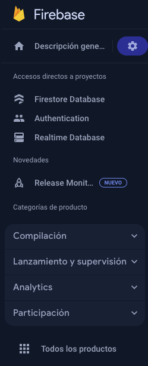

# Configuración de BACKEND SERVICE

---

## Objetivo

* Realizar un entorno de backend funcional.
* Realizar un CRUD (tech a utilizar).

---
## Prerequisitos

* Conocimiento manejo de versiones
* [TENER PROYECTO DE FIREBASE](https://firebase.google.com/docs/functions/get-started?hl=es-419&gen=2nd)
* Tener docker desktop instalado

En este laboratorio levantaremos un servicio de backend.

---
Las tecnologías a utilizar son las siguientes:

* NodeJS
* JS y Express
* Docker
* Firebase
* Firestore
* JSDoc
* ESLint plugin de AirBnB
  
---

## Checklist
- [ ] Conexión con Docker y emulador en localhost:4000
- [ ] Resultado en firestore local de addMessage
- [ ] Resultado de CRUD en firestore local

## Instrucciones

Seguir los pasos descritos para llevar a cabo la práctica de la misma y llegar a cierto nivel de dominio de las tecnologías descritas anteriormente.

---

## Paso 1 Estructura del proyecto

Comenzaremos por ordenar el flujo del proyecto.
En este caso, utilizaremos un MVC, tal como en el proyecto Housse of Valkyr.

>> Estructura del proyecto
- infra
  - compose.yaml
  - Dockerfile
  - Dockerfile.firebase
- node_modules
- src
  - configs
    - config.js
    - db.config.js
  - models
  - router
  - controller
  - utils
  - .eslintrc.js
- test
- package.json
- packae-lock.json
- firebase.json

## Paso 2 Creación del proyecto

Una vez que ya tienes el proyecto creado de Firebase, ahora, sigue instalar las dependencias y estructurar el proyecto.

---

<div style="text-align: center;">
  <h2>
    Directorio root con estructura principal
  <h2>
  
</div>

---

Deberás de ejecutar los siguientes comandos en tu terminal dentro del proyecto.

Dependencias para inicializar el proyecto:
``` 
npm init
npm i firebase-tools
npm i firebase-functions@latest firebase-admin@latest --save
npm i @google-cloud/functions-framework
  ```
Dependencias externas a Google necesarias para el proyecto:
```
npm i chai@4.3.8
npm i chai-http@4.4.0
npm i dotenv
npm i mocha@10.3.0
npm i path
```

Dependencias de desarrollador
```
npm i chai-exclude@2.1.0 --save-dev
npm i cors@2.8.5 --save-dev
npm i cross-env --save-dev
npm i eslint --save-dev
npm i eslint-config-google --save-dev
npm i esm --save-dev
npm i express --save-dev
npm i morgan@1.10.0 --save-dev
npm i nodemon --save-dev
```

#### Tu file `package.json` debe lucir así:


<div style="text-align: center;">
  <h2>
    Documento Package.json
  <h2>
  
</div>

---
## Paso 3 Creación de base de datos Firestore

Antes de pasar con incializar la base de datos Firestore en la UI de tu proyecto Firebase, debemos de instalar lo siguiente:
```
firebase init firestore
```

---
Al correr el comando. Deberás seleccionar las siguientes opciones:
> Opción de utilizar un proyecto existente

> Seleccionar el proyecto de Firebase que ya habías creado anteriormente.

> Te saldrá un error, deberás de acceder al link mostrado en tu terminal e inicializar una base de datos Firestore en la zona que más te plazca.

(Tómate el tiempo de inicializar base de datos de Firestore dentro de tu proyecto de Firebase).

---

## Paso 4 Configuración eslint plugin AirBnB

En el directorio root, deberás ejecutar lo siguiente:
`npm install eslint --save-dev`
Para después ejecutar:
`npx eslint --init`

Selecciona las siguientes opciones:
> Revisar sintaxis y encontrar problemas.

> Opción de JavaScript módulos (import/export)

> Ninguna opción

> No

> Con barra de espacio selecciona solo Node

> Formato JS

Una vez creado, realizar las siguientes modificaciones:

<div style="text-align: center;">
  <h2>
    Documento Eslint antes de modificaciones
  <h2>
  
</div>

Deberás cambiarlo al estándar del proyecto Housse of Valkyr.
```
module.exports = {
  env: {
    es6: true,
    node: true,
  },
  parserOptions: {
    "ecmaVersion": 2018,
  },
  extends: [
    "eslint:recommended",
    "airbnb-base",
  ],
  rules: {
    "no-restricted-globals": ["error", "name", "length"],
    "prefer-arrow-callback": "error",
    "quotes": ["error", "double", {"allowTemplateLiterals": true}],
    "indent": ["error", 4],
    "max-len": ["error", {"code": 120}],
  },
  overrides: [
    {
      files: ["**/*.spec.*"],
      env: {
        mocha: true,
      },
      rules: {},
    },
  ],
  globals: {},
};

```

Ahora sí, tenemos el estándar del equipo Housse of Valkyr de desarrollo del código.

## Paso 5 Configuración Docker
En realidad, veremos a docker desde el punto de vista para el manjeo de versiones, lo comento porque es una herramienta bastante útil en otros ámbitos. Nos permite manejar versiones de una mejor manera. Se realizan ¨contenerizaciones¨, las cuales consisten en isolar cierto nivel de virtualización. Nos permite en este caso manejar mismas versiones, y además, podremos hacer carga directa al emulador de firebase:emulator de manera local, importando y exportando datos.

>> Folder de infra, deberemos de crear un file: ```Dockerfile``` encargado de levantar un ambiente node

```
# syntax=docker/dockerfile:1

# Version de node como argumento
ARG NODE_VERSION=18.19.1

# Seteo version de node
FROM node:${NODE_VERSION}-alpine

# Tomar ambiente de desarrollo
ENV NODE_ENV development

# Cambio en máquina virtual a /app
WORKDIR /app

# Binding y cache de dependencias
RUN --mount=type=bind,source=package.json,target=package.json \
    --mount=type=bind,source=package-lock.json,target=package-lock.json \
    --mount=type=cache,target=/root/.npm \
    npm ci

# Run the application as a non-root user.
USER node

# Copiar resto de documentos.
COPY .. .

# Exponer puerto 3000.
EXPOSE 3000

# Correr la aplicación.
CMD npm run dev

```

>> Folder de infra, deberemos de crear un file: ```Dockerfile.firebase``` encargado de levantar un ambiente firebase

```
# syntax=docker/dockerfile:1

# Version de node como argumento
ARG NODE_VERSION=18.19.1

# Tomar version de node
FROM node:${NODE_VERSION}-alpine

# Ambiente de desarrollo y de base de datos y cloud function
ENV NODE_ENV development
ENV FUNCTION_REGION us-west2

WORKDIR /app

# Instalar Firebase CLI
RUN apk add --no-cache openjdk11-jre \
    && npm install -g firebase-tools nodemon

# Binding y cache de dependencias
RUN --mount=type=bind,source=package.json,target=package.json \
    --mount=type=bind,source=package-lock.json,target=package-lock.json \
    --mount=type=cache,target=/root/.npm \
    npm ci

# Run the application as a non-root user.
USER node

# Copiar el resto de documentos como imagenes.
COPY . .

# Iniciar el emulador de Firebase importando datos y exportandolos (persist-data)
CMD ["npx", "nodemon", "--exec", "firebase", "emulators:start", "--import", "infra/data", "--export-on-exit", "infra/data"]
```

Ahora, ```compose.yaml``` encargado de organizar volúmenes, pues estamos manejando dos contenedores.

```
services:
  core:
    build:
      context: ..
      dockerfile: infra/Dockerfile
    environment:
      NODE_ENV: development
      GOOGLE_APPLICATION_CREDENTIALS: /app/infra/gcloud_key.json
      FIREBASE_EMULATOR_HOST: firebase:8080
    volumes:
      - ../infra/gcloud_key.json:/app/infra/gcloud_key.json:ro
      - ..:/app
      - /app/node_modules
    ports:
      - 3000:3000
  firebase:
    build:
      context: ..
      dockerfile: infra/Dockerfile.firebase
    environment:
      GOOGLE_APPLICATION_CREDENTIALS: /app/infra/gcloud_key.json
      FUNCTION_REGION: us-west2
    ports:
      - 9099:9099 # Firebase Authentication
      - 5002:5001 # Cloud Functions
      - 8080:8080 # Cloud Firestore
      - 8085:8085 # Cloud Pub/Sub
      - 9199:9199 # Cloud Storage
      - 4000:4000 # Emulator Suite UI
      - 9005:9005 # Google Auth
      - 8966:8966
    volumes:
      - ../infra/gcloud_key.json:/app/infra/gcloud_key.json:ro
      - ..:/app
      - /app/node_modules
```

Por último, el archivo ```.dockerignore```, que funciona como un .gitignore, pero el archivo que se ponga dentro, será obviado al momento de construir una imagen.

```
**/.classpath
**/.dockerignore
**/.git
../.idea/.gitignore
**/.project
**/.settings
**/.toolstarget
**/.vs
**/.vscode
**/.next
**/.cache
**/*.*proj.user
**/*.dbmdl
**/*.jfm
**/charts
**/docker-compose*
**/compose*
**/Dockerfile*
**/node_modules
**/npm-debug.log
**/obj
**/secrets.dev.yaml
**/values.dev.yaml
**/build
**/dist
LICENSE
README.md
```

Fuera de mi alcance, deberás de seguir la siguiente instalación de SDK de Google:
* https://cloud.google.com/sdk/docs/install?hl=es-419
* Una vez instalado el sdk y los pasos del proceso anterior, deberás de ejecutar `gcloud auth login`.


Después, deberás de generar una clave de tipo JSON, llave que proporciona el servicio adecuado para utilizar firebase y servicios relacionados con un proyecto de firebase:
* Emulator
* Firestore
* Analytics

Deberás dirigirte a la consola de Google, seleccionando `IAM y administración`.
<div style="text-align: center;">
  <h2>
    Google console, sección Cuentas de Servicio
  <h2>
  
</div>

Verás cuentas de servicio en Google console, deberás seleccionar la cuenta de servicio (acciones) y seleccionar `Administrar claves`.
<div style="text-align: center;">
  <h2>
    Google console, sección Cuentas de Servicio
  <h2>
  
</div>

Después:
> `agregar clave`

> `crear clave nueva`

> `generar clave en formato JSON`

Dicha clave, deberás de poner el archivo JSON dentro del directorio `/infra`. 

Dicho archivo tiene nombre de: `gcloud_key.json`


Teniendo todo lo anterior, el folder de infra luce así:

<div style="text-align: center;">
  <h2>
    Directorio de infraestructura
  <h2>
  
</div>


## Paso 6 Configuración index.js

>> Iniciaremos por hacer la configuración del archivo de ```index.js``` en el directorio root:


```
import express from 'express';
import cors from 'cors';
import morgan from 'morgan';
import functions from './functions.js';

const port = process.env.DEV_PORT || process.env.TESTING_ENVIRONMENT_PORT || 3000;
const loc_env = process.env.NODE_ENV || "development";


const app = express();

app.use(cors());
app.use(morgan('dev'));

app.use(express.json());
app.use(express.urlencoded({ extended: true }));

app.locals.settings = {
    port,
    loc_env,
    db,
};

initRouter(app);

let exportedApp;

if (process.env.FIREBASE_EMULATOR_HOST || process.env.NODE_ENV === "development") {
    exportedApp = functions.https.onRequest(app);
    app.listen(port, () => {
        console.log(`Server is running at http://localhost:${port}`);
    });
} else {
    exportedApp = app;
}

export { exportedApp as app };
```

Lo que se hace en el archivo, es definir un routeo apartir de una aplicación de express, puesto que estaremos definiendo rutas dentro del proyecto.
Además, definimos que dirección tomará nuestra aplicación, si es desarrollo o queremos correr los emuladores, se realiza un request con Cloud Functions, en cualquier otro caso, exportamos la app.

## Paso 8 Configuración ***flujo*** src folder


Podemos iniciar con el flujo de nuestra arquitectura.
Flujo de una aplicación con arquitectura MVC típica utilizando express:
>> app request -> index.routes -> message.routes -> message.controller -> message.models -> db 

>> DB -> message.models -> message.controller -> message.routes -> index.routes -> app request

### 8.1 Configuración directorios

Primero, deberás crear los directorios necesario

<div style="text-align: center;">
  <h4 style="text-align: left;">
    Debe de quedar de la siguiente manera
  <h4>
  <h4 style="text-aign: center;">
  Src folder
  <h4>
  
</div>

### 8.2 Configuración base de datos

### En directorio configs
Agregar y configurar los siguientes dos archivos:
>> ```config.js```
```
import dotenv from 'dotenv';
dotenv.config();
const {
    API_KEY,
    AUTH_DOMAIN,
    PROJECT_ID,
    STORAGE_BUCKET,
    MESSAGING_SENDER_ID,
    APP_ID,
} = process.env;

export const firebaseConfig = {
    apiKey: API_KEY,
    authDomain: AUTH_DOMAIN,
    projectId: PROJECT_ID,
    storageBucket: STORAGE_BUCKET,
    messagingSenderId: MESSAGING_SENDER_ID,
    appId: APP_ID
};
```


>> ```db.config.js```

```
import firebaseAdmin from "firebase-admin";
import dotenv from "dotenv";
import { firebaseConfig } from "./config.js";

dotenv.config();
const env = process.env.NODE_ENV || "development";

let db;

if (env === "development") {
    const app = firebaseAdmin.initializeApp(firebaseConfig);
    db = firebaseAdmin.firestore(app);
    if (process.env.FIREBASE_EMULATOR_HOST) {
        db.settings({
            host: process.env.FIREBASE_EMULATOR_HOST,
            ssl: false,
        });
    }
} else if (env === "production") {
    const app = firebaseAdmin.initializeApp(firebaseConfig);
    db = firebaseAdmin.firestore(app);
}

export { db };
```


Pasaremos a configurar el siguiente file dentro del directorio `routes`, lo nombraremos: `index.routes.js`. Dentro de este archivo, irá el routeo principal hacia cada uno de los módulos deseados, en este caso y cuestiones de tiempo, solo me dedicaré a hacer un `CRUD de un mensaje`.


### 8.3 Configuración de archivos en directorio routes
>> ```index.routes.js```
```
import MessagesRouter from './message.routes.js';
//import UserRouter from './user.routes.js';

export const initRouter = (app) => { 
    app.use('/api/messages', MessagesRouter);
    //app.use('/api/user', UserRouter);
};
```

>> ```message.routes.js```
```
import express from "express";
import * as MessageController from "../controllers/message.controller.js";
const router = express.Router();

router.post("/", MessageController.addMessage);

// router.get("/:messageId", MessageController.getMessage);
// router.get("/message/all", MessageController.getAllMessages);

// router.delete("/delete/:messageId", MessageController.deleteMessage);

export default router;
```


### 8.4 Configuración de archivos en directorio models


>> Acceder a directorio ```models``` y crear lo siguiente ```message.model.js```


A pesar de que Firebase es `Schemaless`, creemos que es la mejor opción utilizar modelos, para saber que tipo de datos se reciben y tener un poco más control sobre los datos.
Utilizaremos clases puras para la definición de los modelos, pues no existe un `Schema` para Firebase y JS (solamente para Firebase y TS).
```
/**
 * Represents a message.
 * @class Message
 */
class Message {
    /**
     * Creates an instance of Message.
     * @param {string} author - The author of the message.
     * @param {string} country - The country associated with the message.
     * @param {string} message - The content of the message.
     * @param {UUID} messageId - The ID of the message.
     */
    constructor(author, country, message, messageId) {
        this.author = author;
        this.country = country;
        this.message = message;
        this.messageId = messageId;
    }

    /**
     * Converts the message object to a map.
     * @return {{author: string, country: string, message: string, messageId: string}}
     */
    toMap() {
        return {
            author: this.author,
            country: this.country,
            message: this.message,
            messageId: this.messageId,
        };
    }

    /**
     * Creates a message object from a map.
     * @param {{author: string, country: string, message: string, messageId: string}} data
     * @return {Message} A new message object.
     */
    static fromMap(data) {
        return new Message(data.author, data.country, data.message, data.messageId);
    }
}

export default Message;
```

### 8.5 Configuración de archivos en directorio controller

Directorio importante, puesto que es parte de los `servicios` que ofrecerá nuestra aplicación, es donde tenemos acceso a la base de datos `Firestore`. Entonces, iré paso por paso, explicando los métodos.

Dicho file tendrá el nombre de `message.controller.js`.

### 8.5.1 Imports necesarios

```
import { collection, doc, setDoc } from "firebase/firestore";
import { db } from "../configs/db.config.js";
import generateId from "../utils/generateId.js";
import Message from "../models/message.model.js";
```


### 8.5.2 Agregar mensaje

```
export const addMessage =
  async (req, res) => {
    const { message, author, country } = req.body.messages; 
    try {
        const newMessage = new Message(
            author,
            country,
            message,
            generateId(),
        ).toMap();
        await db.collection("messages").add(newMessage);

        res.json({ result: `Message with ID: ${newMessage.messageId} added.` });
    } catch (e) {
      console.error("Error adding document: ", e);
    }
  };
```
NO OLVIDE EL ESTÁNDAR DE DOCUMENTACIÓN:

```
/**
 * Add a message to the database.
 * @param {Object} req - The request object.
 * @param {string} req.message - The message content.
 * @param {string} req.author - The author of the message.
 * @param {string} req.country - The country of the author.
 * @param {number} res - The response to send to the client.
 * @returns {Object} An object containing the status and the result of the operation.
 */
export const addMessage =
  async (req, res) => {
    const { message, author, country } = req.body.messages; 
    try {
        const newMessage = new Message(
            author,
            country,
            message,
            generateId(),
        ).toMap();
        await db.collection("messages").add(newMessage);

        res.json({ result: `Message with ID: ${newMessage.messageId} added.` });
    } catch (e) {
      console.error("Error adding document: ", e);
    }
  };

```
En la función addMessage, realizamos un ```POST```, lo cual se comunicará con la base de datos y agregará un nuevo mensaje por medio del BODY.
Método importante, `db.collection`y `.add`

>> ```db.collection()``` se encarga de regresar las ````colecciones```` con el nombre dado

>> ```db.collection().add()``` se encarga de agregar el ``` documento``` a la base de datos


### Paso 9 Configuración de package.json

Deberás escribir lo siguiente en la parte de `scripts`
```
"scripts": {
    "lint": "eslint .",
    "test": "cross-env NODE_ENV=test mocha ./test/*.js --exit",
    "serve": "firebase emulators:start --only functions",
    "shell": "firebase functions:shell",
    "start": "cross-env NODE_ENV=development node index.js",
    "dev": "nodemon index.js",
    "deploy": "firebase deploy --only functions",
    "logs": "firebase functions:log",
    "prepare": "husky install"
  },
```

### Paso 10 variables de entorno

Deberás de crear el .ENV conteniendo la información puesta en `db.config.js`. En este caso, lo pondremos en el folder de infra. Deberás de obtener las llaves proporcionadas por el proyecto de firebase.
Dichas llaves, se pueden encontrar en la página de tu Firebase project.

<div style="text-align: center;">
  <h2>
    En el menú, selecciona el engrenaje
  <h2>
  
</div>

Scrollea la pantalla hasta abajo y verás algo así, como `firebaseConfig`:
```
apiKey=
authDomain=<project-name>.firebaseapp.com
projectId=<project-id>
storageBucket=<project-name>.appspot.com
messagingSenderId=<message-sender-id>
appId=<app-id>
measurementId=<measurement>
```
Guarda las variables, y crea tu `.ENV` dentro de directorio `infra/`.

## Paso 11 Corrección de errores

>> En ```package.json``` deberás escribir:
```
  "type": "module",
```
Justo antes de `"scripts": {},`

>> En ```index.js``` deberás escribir en la parte de arriba:

```
import { db } from "./src/configs/db.config.js";
import { initRouter } from "./src/routes/index.routes.js";
```

En consola, ejecuta:
```
npm i firebase
```

>> En Directorio ```utils``` deberás crear un archivo llamado ```generateId.js``` y escribir lo siguiente:

```
import { v4 as uuidv4 } from "uuid";

const generateId = () => uuidv4();

export default generateId;

```

Ejecutar en terminal:
```
npm i husky
npx husky init
```

>> Ir al archivo de ```firebase.json``` y escribir lo siguiente:
```
{
  "functions": {
    "source": ".",
    "codebase": "default",
    "ignore": [
      "node_modules",
      ".git",
      "firebase-debug.log",
      "firebase-debug.*.log"
    ],
    "predeploy": [
      "npm --prefix \"$RESOURCE_DIR\" run lint"
    ]
  },
  "emulators": {
    "firestore": {
      "port": 8080,
      "host": "0.0.0.0"
    },
    "functions": {
      "port": 5001,
      "host": "0.0.0.0"
    },
    "ui": {
      "enabled": true,
      "port": 4000,
      "host": "0.0.0.0"
    },
    "auth": {
        "port": 9099,
        "host": "0.0.0.0"
    }
  }
}
```

Si seguiste todos los pasos y correción de errores, deberás de correr los contenedores de docker.

## Paso 12 Levantar docker

>> Direcciónate a ```cd /infra``` y correrás ```docker compose up --build```

<div style="text-align: center;">
  <h3>
    Si hiciste todos los pasos anteriores bien, debes ver lo siguiente:
  <h3>
  
</div>

Ahora, tienes acceso localmente a tu base de datos para hacer pruebas locales. 
Para probar en tu navegador, corre:
``` http://localhost:4000```

## Paso 13 Llamada POSTMAN

Para probar la función, usaré POSTMAN integrado con VSCODE, haciendo un POST del `message`.

```Fuera de mi alcance enseñar como integrarlo a VSCODE```

Cuando lo tengas instalado, deberás de cargar lo siguiente:
* Ruta: http://localhost:3000/api/messages/
* Body: 
```
{
	"messages":{
        "author": "Guty",
        "country": "USA",
        "message": "Second test"
    }
}
```
Manda el request, y verás reflejado el resultado en tu emulador, firestore.


<div style="text-align: center;">
  <h3>
    Resultado
  <h3>
  
</div>

### Marcar checklist si se cumplió con la conexión de Firebase emulator y Docker en [Matriz de capacitación](https://docs.google.com/spreadsheets/d/145XwjhKBz13pcvVxq15e32lJOc5O17LS0yksrM53FXE/edit#gid=0).


## Paso 14 Implementación CRUD faltante

>> En ```message.routes.js``` deberás de descomentar las siguientes funciones:
* getAllMessages
* deleteMessage

>> Dirígete a ```message.controller.js```

>> Método ```GET```, analiza, copia y pega lo siguiente:
```
  /**
 * Get all messages from the database.
 * @param {Object} req - The request object.
 * @param {number} res - The response to send to the client.
 * @returns {Object} An object containing the status and the message list.
*/
export const getAllMessages = async (req, res) => {
    try {
        const messagesCollection = db.collection("messages");
        const messages = await messagesCollection.get();
        const messageList = [];
        messages.forEach((doc) => {
            const newMessage = Message.fromMap(doc.data());
            if (newMessage.message === undefined || newMessage.author === undefined || newMessage.country === undefined) {
                res.json({ status: 400, messageList: "Message in wrong format" });
            }
            messageList.push(newMessage);
        });
        res.json({ status: 200, messageList });
    } catch (e) {
        res.json({ status: 400, messageList: "" });
        console.error("Error getting documents: ", e);
    }
};
```

IMPLEMENTAR getMessage en ```message.controller.js```

### Marcar checklist si se pudo realizar getMessage() [Matriz de capacitación](https://docs.google.com/spreadsheets/d/145XwjhKBz13pcvVxq15e32lJOc5O17LS0yksrM53FXE/edit#gid=0).

>> Dirígete a ```message.controller.js```

>> Método ````DELETE````, analiza, copia y pega lo siguiente:
```
/** 
 * Delete a message from the database.
 * @param {Object} req - The request object.
 * @param {string} req.params.messageId - The ID of the message to delete.
 * @param {number} res - The response to send to the client.
 * @returns {Object} An object containing the status and the result of the operation.
*/
export const deleteMessage = async (req, res) => {
    const { messageId } = req.params;
    try {
        const messageQuerySnapshot = await db.collection("messages").where("messageId", "==", messageId).get();
        if (!messageQuerySnapshot.empty) {
            const messageDoc = messageQuerySnapshot.docs[0];
            const messageDelete = Message.fromMap(messageDoc.data());
            if(messageDelete) {
                await messageDoc.ref.delete();
                res.json({ status: 200, result: `Message with ID: ${messageId} deleted.` });
            }
            else {
                res.json({ status: 400, result: `No message with ID: ${messageId} found.` });
            }
        } else {
            res.json({ status: 400, result: `No message with ID: ${messageId} found.` });
        }
    } catch (e) {
        res.json({ status: 400, result: "" });
        console.error("Error deleting document: ", e);
    }
};
```

>> Método ````PATCH````

>> Ve a ```message.routes.js``` y escribe lo siguiente por debajo del método delete:

```
router.patch("/update/:messageId", MessageController.updateMessage);
```

>> Ve a ```message.controller.js``` analiza, copia y pega lo siguiente:

```
/**
 * Update a message in the database.
 * @param {Object} req - The request object as ID.
 * @param {string} req.params.messageId - The ID of the message to update.
 * @param {string} req.body.country - The country of the author.
 * @param {number} res - The response to send to the client.
 * @returns {Object} An object containing the status and the result of the operation.
 * */
export const updateMessage = async (req, res) => {
    const { messageId } = req.params;
    const { country } = req.body;
    try {
        const messageQuerySnapshot = await db.collection("messages").where("messageId", "==", messageId).get();
        if (!messageQuerySnapshot.empty) {
            const messageDoc = messageQuerySnapshot.docs[0];
            const messageUpdate = Message.fromMap(messageDoc.data());
            if(messageUpdate) {
                await messageDoc.ref.update({
                    country,
                });
                res.json({ status: 200, result: `Message with ID: ${messageId} updated.` });
            }
            else {
                res.json({ status: 400, result: `No message with ID: ${messageId} found.` });
            }
        } else {
            res.json({ status: 400, result: `No message with ID: ${messageId} found.` });
        }
    } catch (e) {
        res.json({ status: 400, result: "" });
        console.error("Error updating document: ", e);
    }
}
```

### Marcar checklist si se implementó el CRUD correctamente: [Matriz de capacitación](https://docs.google.com/spreadsheets/d/145XwjhKBz13pcvVxq15e32lJOc5O17LS0yksrM53FXE/edit#gid=0)


## Paso 15 revisar resultado con POSTMAN

<div style="text-align: center;">
  <h3>Resultado</h3>
  <table border="1">
    <tr>
      <th>GET</th>
      <th>DELETE</th>
      <th>PATCH</th>
    </tr>
    <tr>
      <td> 
       
      </td>
      <td>
      
      </td>
      <td>
            
            
      </td>
    </tr>
  </table>
</div>

### Marcar checklist en la matriz de capacitación con SS:

[Matriz de capacitación](https://docs.google.com/spreadsheets/d/145XwjhKBz13pcvVxq15e32lJOc5O17LS0yksrM53FXE/edit#gid=0)

# FELICIDADES HAS TERMINADO EL LABORATORIO BACKEND
