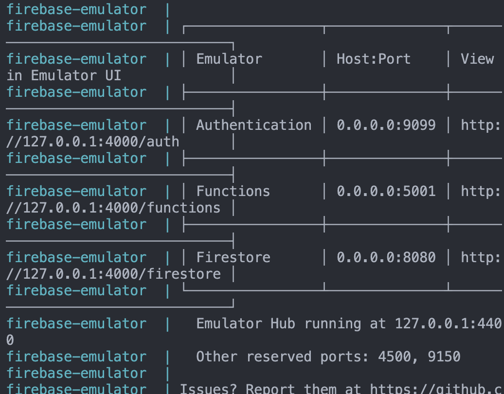
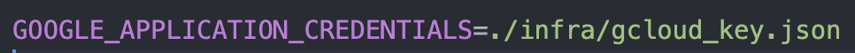
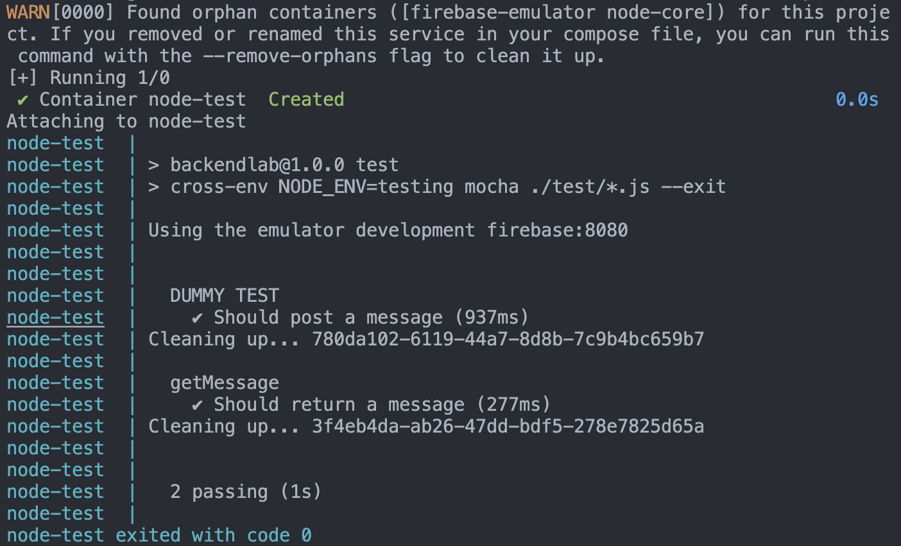
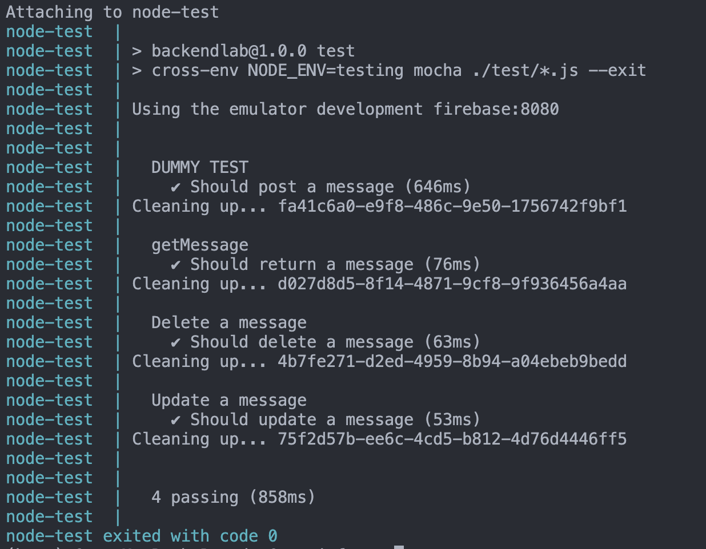

# Laboratorio de Testing

---

## Objetivo

* Realizar conexión de testing local en emulador.
* Realizar tests con chai, mocha y handler estándar.

---
## Prerequisitos

* Conocimiento manejo de versiones
* [TENER PROYECTO DE FIREBASE PREVIAMENTE CREADO EN LABORATORIO DE BACKEND](https://firebase.google.com/docs/functions/get-started?hl=es-419&gen=2nd)
* Tener docker desktop instalado

En este laboratorio de Testing, estaremos dando seguimiento al laboratorio de Backend, por lo que utilizaremos el mismo proyecto de Firebase, por cuestión de simplicidad y tiempos.

---

Las tecnologías a utilizar son las siguientes:

* NodeJS
* JS y Express
* Docker
* Firebase
* Firestore
* JSDoc
* ESLint plugin de AirBnB
* Mocha
* Chai
---

## Checklist
- [ ] Realizar testing PATCH `messages`
- [ ] Demostración testing CRUD `messages`

## Instrucciones

Seguir los pasos descritos para llevar a cabo la práctica de la misma y llegar a cierto nivel de dominio de las tecnologías descritas anteriormente.

---

## Paso 1 Explicación ambientes en Housse of Valkyr

> ### ¿Cómo conseguiremos CI en Housse of Valkyr?
En el proyecto Housse of Valkyr, se automatizará el proceso de revisión de tests de backend (tipo de tests realizados como en este laboratorio) con el fin de obtener CI (Continuous Integration) del ciclo DevOps, en este caso, no cubriremos esa parte, pero es importante que sepamos el proceso llevado a cabo.

Dichos tests correrán cuando haya un Pull Request dirigido a ramas base: main y develop.

>### ¿Cómo funcionará el testing?

Tendremos `4 environments` dentro del proyecto Housse of Valkyr. Un environment de `"development"` local con el emulador cada persona con su base de datos del emulador, uno de `"testing"` que será un ambiente local donde cada uno de los integrantes podrá tener acceso a los tests que haya creado él y los demás de manera local.
Una vez que haya seguridad de que los tests de manera local son correctos, se realizará un Pull Request a `develop`.

En `develop`, se levanta otro ambiente de pruebas, donde se utilizará una base de datos integral `"testing_actions"`. Una vez que pasen los tests, se hará Push a la rama develop, realizando deploy continuo en la cuenta compartida en la cual tendremos acceso todos los miembros del equipo Housse of Valkyr.

Después de esto, al ambiente de `"production"`, cuenta que tendremos como equipo en convenio con el socio formador. Dicho ambiente se encontrará en rama `main`, obteniendo así deploy continuo pero esta vez en cuenta de producción.


## Paso 2 Creación de Dockerfile.test
```
# syntax=docker/dockerfile:1

ARG NODE_VERSION=18.19.1

FROM node:${NODE_VERSION}-alpine

ENV NODE_ENV testing

WORKDIR /app

COPY ./package.json . 
COPY ./package-lock.json .

RUN npm install

# Copy the rest of the source files into the image.
COPY . .

# Expose the port that the application listens on.
EXPOSE 3000

# Run the application.
CMD npm run test
```
## Paso 3 Creación de docker.compose.test
```
version: "3.8"
services:
  test:
    container_name: node-test
    build:
      context: ..
      dockerfile: infra/Dockerfile.test
    environment:
      - NODE_ENV=testing
      - GOOGLE_APPLICATION_CREDENTIALS=/app/infra/gcloud_key.json
      - FIREBASE_EMULATOR_HOST=firebase:8080
      - TESTING_ENVIRONMENT_PORT:3001
    ports:
      - 3001:3001
    volumes:
      - /app/node_modules
```

## Paso 4 Optimización de Docker

En el laboratorio de backend, utilizamos tres files de Docker. Hay dos files que podemos hacerles optimización, pues no queremos hacer un `mount` de las dependencias, simplemente queremos que se copien las dependencias utilizadas al contenedor infra, con sus respectivos volúmenes e imágenes.

> ### `Dockerfile`
```
# syntax=docker/dockerfile:1

ARG NODE_VERSION=18.19.1

FROM node:${NODE_VERSION}-alpine

ENV NODE_ENV development

WORKDIR /app

COPY ./package.json . 
COPY ./package-lock.json .

RUN npm install

# Copy the rest of the source files into the image.
COPY . .

# Expose the port that the application listens on.
EXPOSE 3000

# Run the application.
CMD npm run dev

```

> ### `Dockerfile.firebase`
```
# syntax=docker/dockerfile:1

ARG NODE_VERSION=18.19.1

FROM node:${NODE_VERSION}-alpine

WORKDIR /app

COPY ./package.json . 
COPY ./package-lock.json .

# Install Firebase CLI

RUN apk add --no-cache openjdk11-jre \
    && npm install -g firebase-tools nodemon


RUN npm install

COPY . .

# Start the Firebase emulator
CMD ["npx", "nodemon", "--exec", "firebase", "emulators:start", "--import", "infra/data", "--export-on-exit", "infra/data"]
```

> ### Por último, el file `compose.yaml`
```
version: "3.8"
services:
  core:
    container_name: node-core
    build:
      context: ..
      dockerfile: infra/Dockerfile
    environment:
      - NODE_ENV=development
      - GOOGLE_APPLICATION_CREDENTIALS=/app/infra/gcloud_key.json
      - FIREBASE_EMULATOR_HOST=firebase:8080
    volumes:
      - ../src:/app/src
      - /app/node_modules
    ports:
      - 3000:3000

  firebase:
    container_name: firebase-emulator
    build:
      context: ..
      dockerfile: infra/Dockerfile.firebase
    environment:
      - NODE_ENV=development
      - GOOGLE_APPLICATION_CREDENTIALS=/app/infra/gcloud_key.json
    ports:
      - 9099:9099 # Firebase Authentication
      - 5002:5001 # Cloud Functions
      - 8080:8080 # Cloud Firestore
      - 9199:9199 # Cloud Storage
      - 4000:4000 # Emulator Suite UI
      - 9005:9005 # Google Auth
      - 8966:8966
    volumes:
      - ../src:/app/src
      - /app/node_modules
      - ../infra/data:/app/infra/data
```

Listo, tenemos las optimizaciones y además el setup correcto que será utilizado durante el desarrollo del proyecto de Housse of Valkyr.


## Paso 5 Creación de archivos a utilizar

Comenzaremos por crear el archivo `messages.spec.js` dentro del directorio `test`.

Dentro del file `messages.spec.js`, copia, analiza y pega lo siguiente:

``` 
import mocha from "mocha";

import ExpressRequestHandlerTest from "../src/utils/expressRequestResponseHandlerTest.js"

import "chai-http";
import chai from "chai";
import chaiExclude from "chai-exclude";
import chaiHttp from "chai-http";
import Message from "../src/models/message.model.js";

const { describe, beforeEach, afterEach } = mocha;
import { 
    getMessage,
    addMessage,
    deleteMessage,
    updateMessage
} from "../src/controllers/message.controller.js";


const { expect } = chai;

chai.use(chaiExclude);
chai.use(chaiHttp);
```

Lo único que estamos haciendo, es hacer el setup de nuestro testing. Importando todo lo necesario, modelos, funciones del controlador a realizar testing, librerías e inicializando estas. Además, vemos que está un file: `ExpressRequestHandlerTest`, el cual haremos ahora mismo.


### Paso 5.1 Creación de `util`
Dirígete al directorio `/src/utils/` dentro, haz un file llamado: `expressRequestResponseHandlerTest.js`, copia, analiza y pega lo siguiente:
```
/**
 * This class is used to mock the request and response objects of express
 * for testing purposes.
 */
class ExpressRequestHandlerTest {
    /**
     * Constructor for the ExpressRequestHandlerTest class.
     */
    constructor() {
        this.req = { body: {} | null, params: {} | null };
        this.res = {
            statusCode: 200 | null,
            data: {} | null,
            status: (code) => {
                this.res.statusCode = code;
                return this.res;
            },
            json: (data) => {
               this.res.data = data;
               return this.res;
            }
        };
        this.genericId = null;
    }
    /**
     * This method is used to set the request object.
     * @param {Object} req - The request object.
    */
    setReq(req) {
        this.req = req;
    }
    /**
     * This method is used to set the response object.
     * @returns {Object} - The request object.
     */
    getReq() {
        return this.req;
    }
    /**
     * This method is used to set the response object.
     * @returns {Object} - The response object.
     */
    getRes() {
        return this.res;
    }
}
export default ExpressRequestHandlerTest;
```

Lo que hará el requestResponseHandler, es que nos ayudará a hacer las llamadas a los métodos del controlador que estemos utilizando (`EN TESTING`), pudiendo manejar los atributos principales del manejo de express.


### Paso 5.2 Continuación `messages.spec.js`

Ahora, continuaremos en `messages.spec.js`. Lo que haremos es que mantendremos un único `reqResHandler`, el cual se encargará de hacer las llamadas al controlador. Mantendremos limpios los tests y el `reqResHandler`, esto con el objetivo de que no se vaya a llenar la base de datos integral con datos `dump`.

```
let reqResHandler;

// Antes de cada test iniciar el reqResHandler
beforeEach(async () => {
    if(!reqResHandler) {
        reqResHandler = new ExpressRequestHandlerTest();
    }
});

// Después de cada test, limpiar con algún método del controlador lo utilizado
afterEach(async () => {
    if(reqResHandler) {
        console.log("Cleaning up...", reqResHandler.genericId);
        reqResHandler = null;
    }
    reqResHandler = null;
});

```

Ya que tenemos lo anterior, pasaremos a hacer testing `CRUD` del modelo `messages` dentro del file `messages.spec.js`.

```
// Global variable to store the message ID
describe("DUMMY TEST", () => {
    it("Should post a message", async () => {
        reqResHandler.req.body = new Message(
            "John Doe", "USA", "Hello"
        ).toMap();

        await addMessage(reqResHandler.req, reqResHandler.res);

        let mssgId = reqResHandler.res.data.messageId;
        reqResHandler.genericId = mssgId;

        const responseDataPostMessage = reqResHandler.res.data;

        expect(responseDataPostMessage.result).to.equal(`Message with ID: ${mssgId} added.`);
    });
});
```

Lo que estamos haciendo es lo siguiente:
> describe() define el nombre de lo que se está testeando

> it() describe lo que se espera del test, en este caso `async` porque las llamadas al controlador son promesas que deben resolverse.

> Creamos el `modelo mensaje` que queremos testear con los atributos necesarios definidos en el modelo.

> Llamada al controlador que llama a la base de datos, con parámetros, utilizamos el `reqResHandler.req (request)`, `reqResHandler.res (response)`. Esto ya que podemos pasar`params y/o body como req`, y como respones `podemos recibir varias cosas`, lo cual es especificado en el controlador.

> En este caso, al hacer un `POST` mandamos el body y después de llamar al método recibimos el `mssgId`, el cual nos ayudará a saber que sí se agregó el mensaje en la base de datos. Esto lo revisamos con la función `expect().to.equal()`

Ahora, haremos el testing de un método `GET`.
```
describe("getMessage", () => {
    it("Should return a message", async () => {
        // Create a new instance of the ExpressRequestHandlerTest class
        reqResHandler.req.body = new Message(
            "John Doe", "USA", "Hello"
        ).toMap();

        await addMessage(reqResHandler.req, reqResHandler.res);
        
        let mssgId = reqResHandler.res.data.messageId;
        reqResHandler.genericId = mssgId;

        reqResHandler.req.params = { messageId: mssgId };

        const expectedMessage = new Message(
            "John Doe", "USA", "Hello", mssgId
        ).toMap();

        await getMessage(reqResHandler.req, reqResHandler.res);
        
        const responseDataGetMessage = Message.fromMap(
            reqResHandler.res.data.messageDoc
            ).toMap();

        expect(responseDataGetMessage).to.deep.equal(expectedMessage);
    });
});
```
En este test hacemos uso de `addMessage()` y además de `getMessage()`, puesto que cómo dije anteriormente, después de realizar cada método, debemos de limpiar lo realizado en el test. En este caso, por eso realizamos un `POST` y al final comparamos que ese mensaje posteado se puede retraer (`GET`), al final comparamos que el mensaje retraído sea igual al que esperamos, comparando que los dos mensajes sean iguales.


## Paso 6 Levantar Docker.test

Para poder correr el ambiente de pruebas, tenemos que realizar varios comandos.


Recomiendo hacer los siguientes `3` comandos cuando haya errores con docker, o en este caso, que hicimos optimizaciones (rara vez pasará).

Para limpiar todos los `contenderos` (cuidado con el comando si utilizas docker para otros fines).
```
docker container prune
```

Para limpiar todas las `volúmenes` (cuidado con el comando si utilizas docker para otros fines)
```
docker volume prune
```

Para limpiar todas las `imágenes` (cuidado con el comando si utilizas docker para otros fines)
```
docker image prune
```

Si quieres continuar con alguna de los comandos definidos en este paso, deberás de seleccionar y/N y para aceptar la operación N para declinar la operación.

>Antes de levantar los contenedores, copia y pega lo siguiente en `src/configs/db.config.js`:

```
import dotenv from "dotenv";
import firebaseAdmin from "firebase-admin";
import { firebaseConfig } from "./config.js";

if(process.env.NODE_ENV === "testing") { 
    dotenv.config({ path: "./infra/.env" });
} else {
    dotenv.config();
}

const env = process.env.NODE_ENV || "development";

let db;
if (env === "development" || env === "testing") {
    // SETUP CONFIG DATABASE
    const app = firebaseAdmin.initializeApp(firebaseConfig);
    db = firebaseAdmin.firestore(app);
    // Points to emulator
    console.log("Using the emulator development", process.env.FIREBASE_EMULATOR_HOST);
    db.settings({
        host: process.env.FIREBASE_EMULATOR_HOST,
        ssl: false,
    });
} else {
    // Merge with develop or main
    // npm run testing:actions / production
    const gCloudCredentials = process.env.GOOGLE_CLOUD_CREDENTIALS;
    // Testing database
    // CI/CD database GITHUB ACTIONS
    const serviceAccount = JSON.parse(gCloudCredentials);
        const app = firebaseAdmin.initializeApp({
        credential: firebaseAdmin.credential.cert(serviceAccount),
    });
    db = firebaseAdmin.firestore(app);
}
export { db };
```

Ahora que tenemos todo restaurado y actualizado, pasaremos a realizar los siguientes comandos:
```
docker compose up --build
```
<div style="text-align: center;">
  

  
</div>

Antes de ejecutar el siguiente comando de docker, deberás de incluir en tu archivo de variables de entorno lo siguiente, esto pues necesitamos la cuenta de servicio que nos proporciona Google.

<div style="text-align: center;">
  <h3>
    .Env
  <h3>
  
</div>

Además deberás de cambiar el NODE_ENV a `testing` proporcionado en `package.json`, escribiendo lo siguiente en `scripts`:

`"test": "cross-env NODE_ENV=testing mocha ./test/*.js --exit",`

Antes, una modificación, debemos de ser consistentes con modelos y parseo en el controlador. Haz la siguiente modificación en el método addMessage del directorio `/src/controllers/message.controller.js`

```
export const addMessage =
  async (req, res) => {
    const { author, country, message } = req.body;
    try {
        const newMessage = new Message(
            author,
            country,
            message,
            generateId(),
        ).toMap();
        await db.collection("messages").add(newMessage);
        res.json({ result: `Message with ID: ${newMessage.messageId} added.`, messageId: newMessage.messageId  });
    } catch (e) {
      console.error("Error adding document: ", e);
    }
  };
```

Último cambio, deberás de poner lo siguiente en `/src/configs/config.js`

```import dotenv from 'dotenv';
dotenv.config({ path: "./infra/.env" });

dotenv.config();
const {
    API_KEY,
    AUTH_DOMAIN,
    PROJECT_ID,
    STORAGE_BUCKET,
    MESSAGING_SENDER_ID,
    APP_ID,
} = process.env;

export const firebaseConfig = {
    apiKey: API_KEY,
    authDomain: AUTH_DOMAIN,
    projectId: PROJECT_ID,
    storageBucket: STORAGE_BUCKET,
    messagingSenderId: MESSAGING_SENDER_ID,
    appId: APP_ID
};
```

Ahora sí, podrás ejecutar lo siguiente en tu terminal:
```
docker compose -f compose.test.yaml up --build
```
<div style="text-align: center;">
  <h3>
    Deberás ver lo siguiente
  <h3>
  
</div>
Si no te ha funcionado, puedes acercarte a Gabriel Córdoba (Gabo) o a Daniel Gutiérrez (Guty).

> #### Nota 1, si ya cargaste los contenederos y no te ha funcionado el de testing, puedes hacer levantarlo nuevamente con un shortcut: `docker compose -f compose.test.yaml up`
> #### Nota 2, si algún comando de arriba no te funciona, deberás de manualmente eliminar el contenedor, imágenes y volúmenes correspondientes y correr nuevamente los dos comandos anteriores.


## Paso 7 Seguimiento de CRUD messages

Ahora, haremos el testing de un método `DELETE`.
```
describe("Delete a message", () => {
    it("Should delete a message", async () => {
        reqResHandler.req.body = new Message(
            "John Doe", "USA", "Hello"
        ).toMap();
        await addMessage(reqResHandler.req, reqResHandler.res);

        let mssgId = reqResHandler.res.data.messageId;
        reqResHandler.genericId = mssgId;

        reqResHandler.req.params = { messageId: mssgId };

        await deleteMessage(reqResHandler.req, reqResHandler.res);
        const responseDataDeleteMessage = reqResHandler.res.data;

        expect(responseDataDeleteMessage.result).to.equal(`Message with ID: ${mssgId} deleted.`);
    });
});
```

Si te fijas, es un proceso repetitivo lo de hacer el testing, hay muchas funciones que nos brinda mocha para poder hacer igualaciones entre varias estructuras de datos y anidaciones. Creadmos un mensaje, lo añadimos a la base de datos, con lo que nos regresa el controlador modificamos el `handler` asignando el ID del mismo, lo que nos sirve para borrar ese mensaje con el mismo ID, llamar al controlador borrando el mensaje y esperando que la respuesta del controlador sea la misma a la que esperábamos en un inicio.


Bien, ahora es momento de que lo hagas tú. Deberás de realizar testing de un método `PATCH`. Ya tenemos la función en el controlador `updateMessage()` por lo que únicamente deberás de realizarlo por tu cuenta...

### Marcar checklist si se pudo realizar testing updateMessage() [Matriz de capacitación](https://docs.google.com/spreadsheets/d/145XwjhKBz13pcvVxq15e32lJOc5O17LS0yksrM53FXE/edit#gid=0).


## Paso 8 Demostración de tests

Si no estás corriendo los contenedores de Docker, lo que pasará entonces es que deberás inicializarlos nuevamente para ver que sí funcionan tus tests.

Ya no es necesario hacer un build de todo el contenedor, únicamente con los siguientes comandos:

```
docker compose up
```
Espera a ver que se haya cargado el emulador e (que salga la pequeña tabla de que han cargado los tests) inserta el siguiente comando en otra terminal:

```
docker compose -f docker.compose.test up
```

Si seguiste todos los pasos deberás ver algo así:

<div style="text-align: center;">
  <h3>
    Resultado testing CRUD
  <h3>
  
</div>


### Marcar checklist si se implementó el testing de CRUD correctamente, pasando todos los tests: [Matriz de capacitación](https://docs.google.com/spreadsheets/d/145XwjhKBz13pcvVxq15e32lJOc5O17LS0yksrM53FXE/edit#gid=0)

# FELICIDADES HAS TERMINADO EL LABORATORIO TESTING